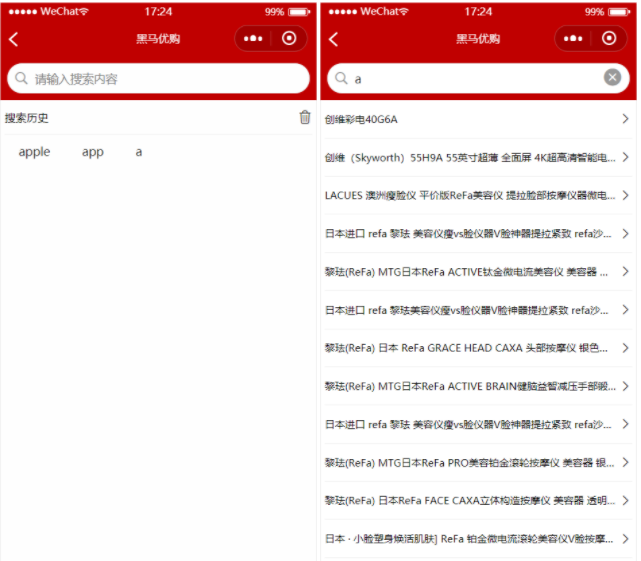

## 搜索页面




## `uni-search-bar`

使用`searchBar`时，如果需要组件加载完成时，自动聚焦输入框，

#### 在组件props中添加属性

```js
			// 添加一个接收值为  是否让搜索框自动获取焦点
			autoFocus: {
				type: Boolean,
				default: false
			},
			// 添加一个整体盒子的背景颜色
			boxBgColor: {
				type: String,
				default: "#fff"
			}
```

#### 在组件中添加事件

```js
		methods: {
			searchClick() {
				if (this.show) {
					return
				}
				this.searchVal = ""
				this.show = true;
				this.$nextTick(() => {
					this.showSync = true;
				})
			},
        },
		// 组件创建后
		created() {
			// 如果需要自动聚焦
			if (this.autoFocus) {
				// 触发自动聚焦事件
				this.searchClick();
			}
		}
```

#### 使用组件时

```html
<!-- 添加autoFocus控制 -->
<uni-search-bar :radius="100" :autoFocus="true" boxBgColor="#c00000" cancelButton="none" @input="inputSearch"></uni-search-bar>
```


## 搜索防抖处理

为了避免用户每次触发input事件都发送请求，并且减轻服务器压力

我们要想办法在用户短暂的暂停输入时，再进行发送请求

* data中记录一个定时器

  ```js
  data() {
  	return {
  		// 搜索关键字
  		keyWords: "",
  		// 记录定时器编号
  		timer: null
  	};
  },
  ```

* 监听用户输入事件，<font color=red>利用延时器，在用户连续输入时，取消发送请求</font>；在用户暂停输入时，如果延时器没有被取消，则会触发请求事件，获取搜索数据

```js
/**
 * 输入搜索关键字
 * @param {Object} e
 */
inputSearch(e) {
	// 防抖处理
	// 清楚上次用来赋值的定时器，取消赋值
	clearTimeout(this.timer);
	// 启动一个新的定时器，准备赋值
	this.timer = setTimeout(()=>{
		// 500ms后，用户暂停输入时，进行赋值keyWords
		this.keyWords = e.value;
        // 发起请求获取搜索结果
		this.getSearchResult();
	},500)
},
```


## 记录搜索历史

搜索成功后，将用户搜索的关键字记录下来，排序，去重，持久化存储的用户本地

```js
/**
 * 获取搜索结果
 */
getSearchResult() {
	// 判断关键字是否为空
	if (this.keyWords.trim().length==0) {
		// 没有输入内容时，清空搜索结果列表
		return this.searchResult = [];
	};
	// 发请求
	getDatasAndSave('/api/public/v1/goods/qsearch?query='+this.keyWords, this, "searchResult",()=>{
		// 搜索成功后，将本次关键字添加到数组前
		this.searchHistory.unshift(this.keyWords);
		// 去重 (使用set)
		this.searchHistory = Array.from(new Set(this.searchHistory));
		// 记录到本地 
		uni.setStorageSync("searchHistory", this.searchHistory);
	});
},
/**
 * 清除历史搜索记录
 */
clearSearchHistory() {
	// 清空
	this.searchHistory = [];
	// 记录到本地
	uni.setStorageSync("searchHistory", this.searchHistory);
},

```

再次进入搜索页时，获取本地记录

```js
// 页面加载时
onLoad() {
	// 从本地取搜索历史记录
	this.searchHistory = uni.getStorageSync('searchHistory') || [];
},
```


## `uni-tag`

使用`uni-tag`时，要注意，

* 要给父元素`display:flex` 才能让标签行内排列
* 可以使用`.uni-tag`调节标签样式

```html
<!-- 搜索历史记录 推荐词 -->
<view class="search-history-content">
	<!-- 给uni-tag里添加自定义属性nobg，将其没有背景色 -->
	<uni-tag :text="item" v-for="(item,index) in searchHistory" :key="index" nobg="true" @click="navToGoodsList(item)"></uni-tag>
</view>

```

```scss
	.search-history-content {
		display: flex;
		flex-wrap: wrap;
		border-top: 1px solid #f6f6f6;
		margin: 0px 20rpx 0px;

		.uni-tag {
			margin: 0 10rpx;
		}
	}
```

