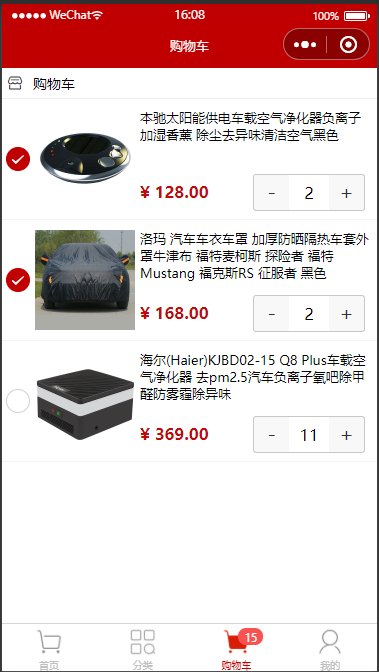

## 购物车页面



## 使用 `mixin`

`vue3`已经弃用

类似于微信小程序的`behaviors`

#### 什么时候使用

有时，我们需要在多个不同页面 重复添加 部分相同代码块，此时就可以使用 `mixin` 来代替

#### 如何使用

我们可以在根目录下创建 `mixins`文件夹

然后创建`mixinXXX.js` 文件

写入需要的代码块

```js
// 共享 购物车总数的mixin
import {
	mapGetters,
	mapState
} from 'vuex';

export default {
	// 页面显示时
	onShow() {
		// 设置tabbar徽章
		this.setBadge();
	},
	computed: {
		// 映射 购物车总数
		...mapGetters('storeCart', ['cart_total']),
		...mapState("storeCart", ['cart'])
	},
	methods: {
		setBadge() {
			// 设置徽章
			uni.setTabBarBadge({
				index: 2,
				// 注意给字符串
				text: this.cart_total == 0 ? 0 : this.cart_total + ''
			})
		}
	}
}
```

* 在需要用到的页面中导入，使用

  ```js
  	// 导入购物车混入
  	import mixinCart from "../../mixins/mixinCart.js";
  
  	export default {
  		mixins: [mixinCart],
      }
  ```

* 这样，我们就可以在使用混入的页面中，使用混入的代码体了

### 使用场景

在这里，我们在一进入小程序时，不论打开哪个`tabbar`页面，都需要 获取到共享数据库中的数据（购物车中商品的数量），在页面显示时，设置到`tab`中 购物车 的徽章上，所以我们将 这部分代码块，封装到一个`mixin`中，四个`tabbar`页面一起使用。


## `uni-number-box`  数字输入框

使用此组件时，要注意，这个输入框可以输入非数字内容，所以我们需要对组件内部进行修改（但是如果是使用`uni-modules`开发，手动修改也没用）

### 解决 `NumberBox` 数据不合法的问题

让其在失去焦点的时候，如果输入的不是数字，将其归为我们组件设置的最小值

```js
			_onBlur(event) {
				let value = event.detail.value;
				// 如果没有值 或者 值不是数字时
				if (!value || isNaN(value)) {
					// 归为最小值
					this.inputValue = this.min;
					return;
				}
				// 如果值不是数字，使用parseInt转换
				value = parseInt(value);
				if (value > this.max) {
					value = this.max;
				} else if (value < this.min) {
					value = this.min;
				}
				this.inputValue = value;
			}
```


#### 或者

1. 打开项目根目录中 `components/uni-number-box/uni-number-box.vue` 组件，修改 `methods` 节点中的 `_onBlur` 函数如下：

   ```js
   _onBlur(event) {
     // 官方的代码没有进行数值转换，用户输入的 value 值可能是非法字符：
     // let value = event.detail.value;
   
     // 将用户输入的内容转化为整数
     let value = parseInt(event.detail.value);
   
     if (!value) {
       // 如果转化之后的结果为 NaN，则给定默认值为 1
       this.inputValue = 1;
       return;
     }
   
     // 省略其它代码...
   }
   ```

2. 修改完毕之后，用户输入**小数**会**被转化为整数**，用户输入**非法字符**会**被替换为默认值 1**

### 完善 `inputValue` 侦听器

> 问题说明：在用户每次输入内容之后，都会触发 `inputValue` 侦听器，从而调用 this.$emit("change", `newVal`) 方法。这种做法可能会把不合法的内容传递出去！

1. 打开项目根目录中 `components/uni-number-box/uni-number-box.vue` 组件，修改 `watch` 节点中的 `inputValue` 侦听器如下：

   ```js
   inputValue(newVal, oldVal) {
     // 官方提供的 if 判断条件，在用户每次输入内容时，都会调用 this.$emit("change", newVal)
     // if (+newVal !== +oldVal) {
   
     // 新旧内容不同 && 新值内容合法 && 新值中不包含小数点
     if (+newVal !== +oldVal && Number(newVal) && String(newVal).indexOf('.') === -1) {
       this.$emit("change", newVal);
     }
   }
   ```

2. 修改完毕之后，`NumberBox` 组件只会把**合法的、且不包含小数点的新值**传递出去

### 使用

```html
<uni-number-box class="goods-count" v-if="showNumChanger" :min="1" :value="item.goods_count" @change="handleChangeCount"></uni-number-box>
```

```js
		methods: {
			// 改变选中状态
			handleChangeChecked() {
				// 触发自定义改变选择状态事件
				this.$emit("changeChecked", {
					goods_id: this.item.goods_id,
					goods_checked: !this.item.goods_checked
				});
			},
			/**
			 * 改变选购数量 (注意：uni-number-box在渲染第一遍时，会执行此函数)
			 * @param {String} val 默认参数为输入框当前值
			 */
			handleChangeCount(val) {
				// 触发自定义的改变选购数量事件
				this.$emit("changeCount", {
					goods_id: this.item.goods_id,
					goods_count: +val
				})
			}
		},
```


* min：设置最小值
* value：设置初始值
* @change：值改变时触发，可以在触发方法的默认参数中获取到值


### 总结：

当我们使用的官方组件不完善时，我们可以在理解组件如何运行的情况下，酌情完善


## 在页面中使用mutations方法时

可以有俩种使用方式

```js
		methods: {
			// 如下：俩种使用共享库中modules的mutation方法的方式
			// 映射改变选中状态的mutation方法 （适合直接用于模板绑定）
			...mapMutations("storeCart", ["changeGoodsChecked"]),
			// 改变商品数量时触发
			changeCountHandler(goodsInfo) {
				// 修改共享库中的数据（适合需要灵活调用的情况）
				this.$store.commit("storeCart/changeGoodsCount", goodsInfo);
            }
```

