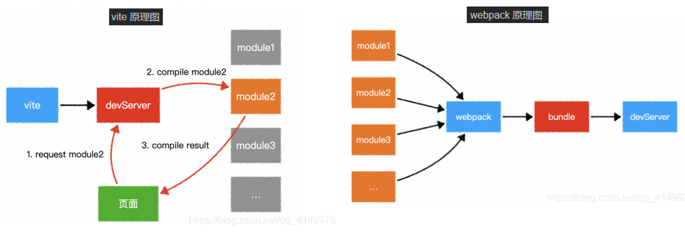

## Vite

### 单页面应用程序-特点

#### 优点：

* 具有桌面应用的即时性，网站的可移植性和可访问性
* 用户体验好、快，内容的改变不需要重新加载整个页面，web应用更具响应性
* 基于上面一点，SPA相对对服务器压力小
* 良好的前后端分离，SPA和Restful架构一起使用，后端不在负责模板渲染、输出页面工作，web前端和各种移动终端地位对等，后端API通用化
* 对前端人员JavaScript技能要求更高，促使团队技能提升

#### 缺点：

* 分功能模块的鉴权不好实现
* 不利于SEO （SSR服务器渲染 nuxt-vue， next-react）
* 初次加载耗时相对增多。（首屏加载优化，骨架屏）
* 对开发人员技能水平要求高、开发成本高

### 快速创建SPA

* Webpack类型： `Vue-CLI`， `CRA`
* 非Webpack类型的： Vite

### 基本使用 - 创建项目

#### Vite是什么？

Vite这个单词是一个法语单词，意思就是轻快的意思。它和我们以前使用Vue-cli的作用基本相同，都是项目初始化构建工具，相当于Vue项目构建的第二代产品，当然它也包含了项目的编译功能。需要注意一下Vite的生产环境下打包是通过Rollup来完成的。

#### Vite的特点:

* Vite主打特点就是轻快冷服务启动。冷服务的意思是，在开发预览中，它是不进行打包的。

* 开发中可以实现热更新，也就是说在你开发的时候，只要一保存，结果就会更新。
* 按需进行更新编译，不会刷新全部DOM节点。这功能会加快我们的开发流程度

#### Vite和webpack的区别

webpack会先打包，然后启动开发服务器，请求服务器时直接给予打包结果。而vite是直接启动开发服务器，请求哪个模块再对该模块进行实时编译。

由于现代浏览器本身就支持ES Module，会自动向依赖的Module发出请求。vite充分利用这一点，将开发环境下的模块文件，就作为浏览器要执行的文件，而不是像webpack那样进行打包合并。

由于vite在启动的时候不需要打包，也就意味着不需要分析模块的依赖、不需要编译，因此启动速度非常快。当浏览器请求某个模块时，再根据需要对模块内容进行编译。这种按需动态编译的方式，极大的缩减了编译时间，项目越复杂、模块越多，vite的优势越明显。

在HMR（热更新）方面，当改动了一个模块后，仅需让浏览器重新请求该模块即可，不像webpack那样需要把该模块的相关依赖模块全部编译一次，效率更高。

当需要打包到生产环境时，vite使用传统的Rollup（也可以自己手动安装webpack来）进行打包，因此，vite的主要优势在开发阶段。另外，由于vite利用的是ES Module，因此在代码中（除了vite.config.js里面，这里是node的执行环境）不可以使用CommonJS

### Vite项目的运行流程

## 组件基础

组件化从狭义的角度来说一般就是指把 DOM 结构封装成一个个的自定义标签，他们可以有自己的自定义属性。

组件化从广义的角度来说一般就是指对数据逻辑层的业务代码，把一些业务逻辑代码封装在组件内部，并对外提供接口。

一个自己封装的 button，search 都可以叫做组件，组 是说一种组织方式，件 是说一个个的功能，可以随时替换为其它可以实现相同功能的 件。

### 组件化开发的好处

* 协同开发，提高开发效率
* 提高代码（组件）的复用性
* 开发、调试、找 Bug 都更简单，可以用排除法移除不相关组件
* 降低耦合度，当由于需求的变更某个组件不满足需求时，可以马上替换为新的组件
* 提高可维护性，由于每个组件的职责单一，并且组件在系统中是被复用的，所以对代码进行优化可获得系统的整体升级
* 组件可以积累下来，在不同的系统中使用，积累多了之后可以形成公司内的一套组件库，还可以不断更新
* 使用接口（props、events和methods）使少量的耦合明显且可控
* 拆分复杂度，减少你需要同时关注的代码量和状态，减轻程序员的思维负担
* 隔离复杂度，把高复杂度的代码隔离起来，易于维护和重构

### 组件之间的数据共享

* 父传子：props
* 子传父：emit函数回调
* 兄弟：mitt插件
* 后代：provide，inject